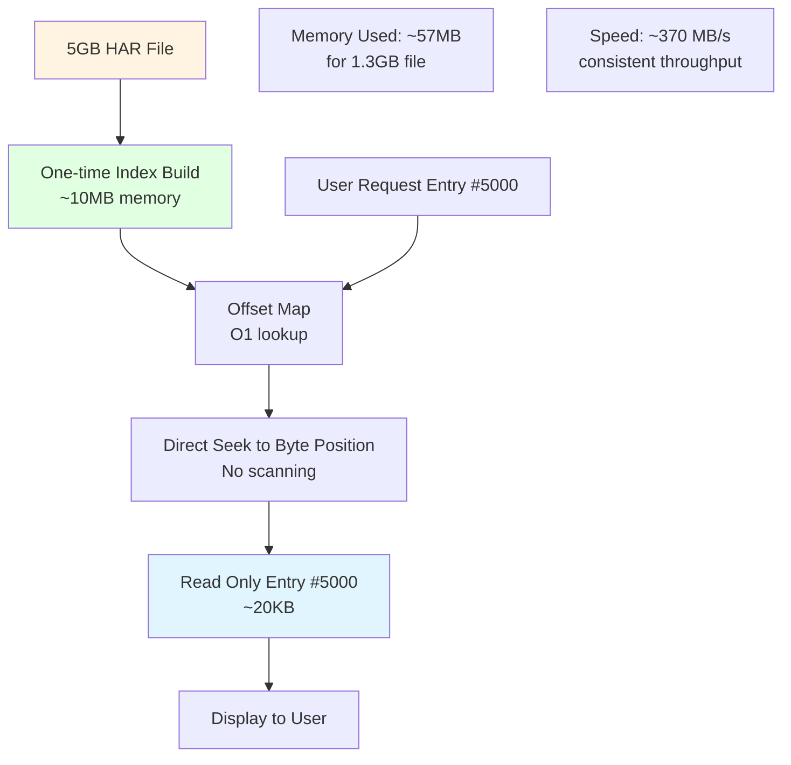
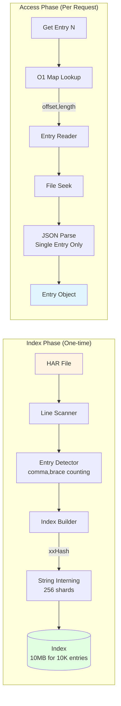
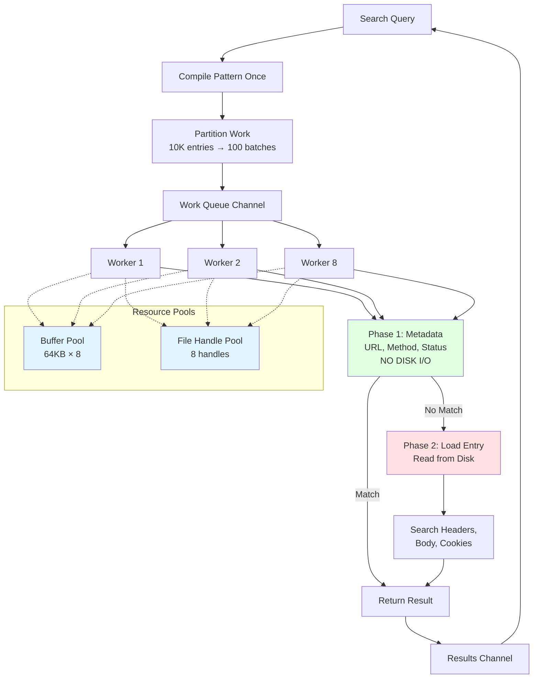
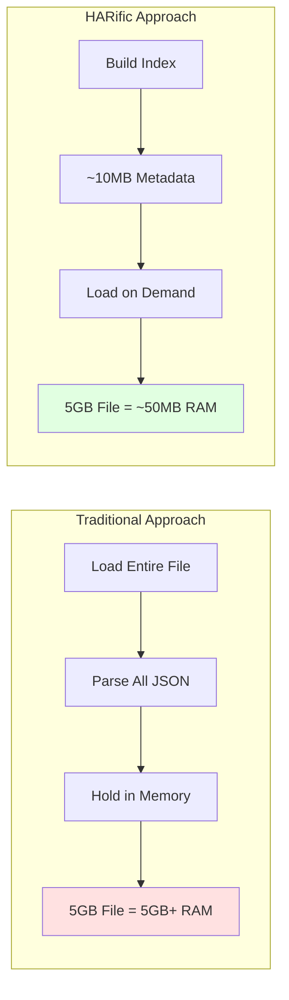
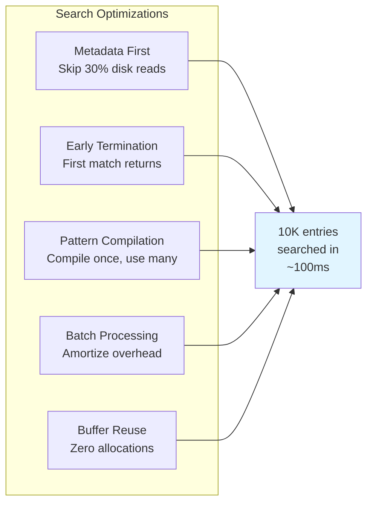

# HARific - High-Performance HAR File Toolkit


## Quick Start

### Installation

```bash
git clone https://github.com/pb33f/harific.git
cd harific
make build
```

### Usage

```bash
# View HAR file in interactive TUI
./bin/harific view recording.har

# Generate test HAR files
./bin/harific generate -n 1000 -o test.har

# Generate with search term injection
./bin/harific generate -n 100 --inject apple,banana --locations url,response.body

# Show all commands
./bin/harific --help
```

## Background

Driven by frustration with diagnosing customer problems from browser experiences, HARific was built to solve a real problem: being unable to see what the customer saw, in the way they saw it. Diagnosing performance problems or rendering issues without proper tools is really hard. HARific provides visual exploration of gigantic HAR files in the terminal, with plans for a replay server that will replay every response back to the browser, complete with breakpoints to pause the conversation anywhere.

## Architecture

### Why HARific is Fast and Memory Efficient



### HAR Streamer Engine Architecture



### Search Engine Architecture



### Terminal UI Architecture

```mermaid
flowchart TB
    subgraph "Bubbletea Framework"
        Model[HARViewModel] --> Update[Update Loop]
        Update --> View[View Renderer]
        View --> Terminal[Terminal Display]

        Keyboard[Keyboard Input] --> Messages[Tea Messages]
        Messages --> Update
    end

    subgraph "View Modes"
        Table[Table View]
        Split[Split View<br/>Request | Response]
        Search[Search Mode]
        Filter[Filter Modal]
    end

    subgraph "Components"
        TableComp[Colorized Table<br/>Method coloring]
        Viewport1[Request Viewport<br/>Scrollable]
        Viewport2[Response Viewport<br/>Scrollable]
        SearchInput[Search Input<br/>Live debouncing]
        Progress[Progress Bar<br/>Index building]
    end

    Model --> Table
    Model --> Split
    Model --> Search
    Model --> Filter

    Table --> TableComp
    Split --> Viewport1
    Split --> Viewport2
    Search --> SearchInput
    Model --> Progress

    style Model fill:#e1ffe1
    style Terminal fill:#e1f5ff
    style TableComp fill:#ffe1e1
```

## Performance

| File Size | Entries | Time   | Throughput  | Time/Entry |
|-----------|---------|--------|-------------|------------|
| 700MB     | 9,720   | 1.90s  | 367.76 MB/s | 195.84 μs  |
| 1GB       | 14,126  | 2.77s  | 369.87 MB/s | 196.00 μs  |
| 2GB       | 28,262  | 5.57s  | 367.93 MB/s | 196.96 μs  |
| 5GB       | 70,689  | 13.62s | 375.80 MB/s | 192.73 μs  |

### Key Performance Characteristics

- **Consistent Performance**: ~370 MB/s regardless of file size
- **Linear Scaling**: Processing time scales perfectly with file size
- **Predictable**: ~195 microseconds per entry consistently
- **Memory Efficient**: ~57MB for 1.3GB file 

## Technical Details

### Why It's Fast

1. **Streaming Architecture** - Never loads entire file into memory
2. **Offset-based Indexing** - O(1) random access to any entry
3. **String Interning** - 256-sharded hash tables reduce memory duplication
4. **xxHash** - 13 GB/s hashing speed (vs 450 MB/s for MD5)
5. **Lazy Loading** - Only reads entries when requested
6. **Worker Pools** - Parallel search across CPU cores
7. **Buffer Pooling** - Reuses memory via sync.Pool

### Memory Efficiency



### Search Performance Optimization

