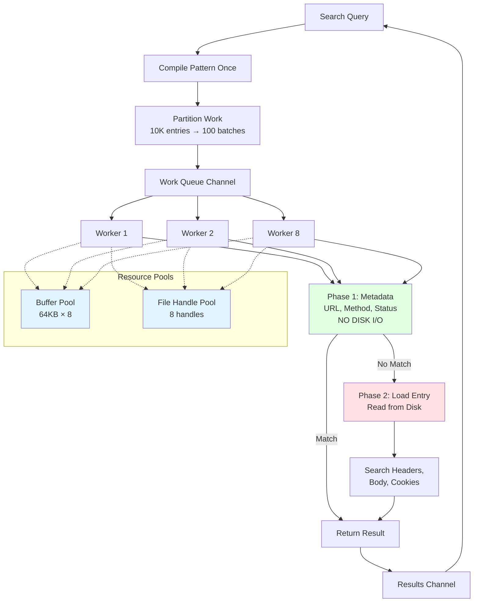

# HARific - High-Performance HAR File Toolkit


## Quick Start

### Installation

```bash
git clone https://github.com/pb33f/harific.git
cd harific
make build
```

### Usage

```bash
# View HAR file in interactive TUI
./bin/harific recording.har

# Show all commands
./bin/harific --help
```

## Background

Driven by frustration with diagnosing customer problems from browser experiences, HARific was built to solve a real problem: being unable to see what the customer saw, in the way they saw it. Diagnosing performance problems or rendering issues without proper tools is really hard. HARific provides visual exploration of gigantic HAR files in the terminal, with plans for a replay server that will replay every response back to the browser, complete with breakpoints to pause the conversation anywhere.

## Search Engine Architecture



## Performance

| File Size | Entries | Time   | Throughput  | Time/Entry |
|-----------|---------|--------|-------------|------------|
| 700MB     | 9,720   | 1.90s  | 367.76 MB/s | 195.84 μs  |
| 1GB       | 14,126  | 2.77s  | 369.87 MB/s | 196.00 μs  |
| 2GB       | 28,262  | 5.57s  | 367.93 MB/s | 196.96 μs  |
| 5GB       | 70,689  | 13.62s | 375.80 MB/s | 192.73 μs  |

- **Consistent Performance**: ~370 MB/s regardless of file size
- **Linear Scaling**: Processing time scales perfectly with file size
- **Predictable**: ~195 microseconds per entry consistently
- **Memory Efficient**: ~57MB for 1.3GB file 
